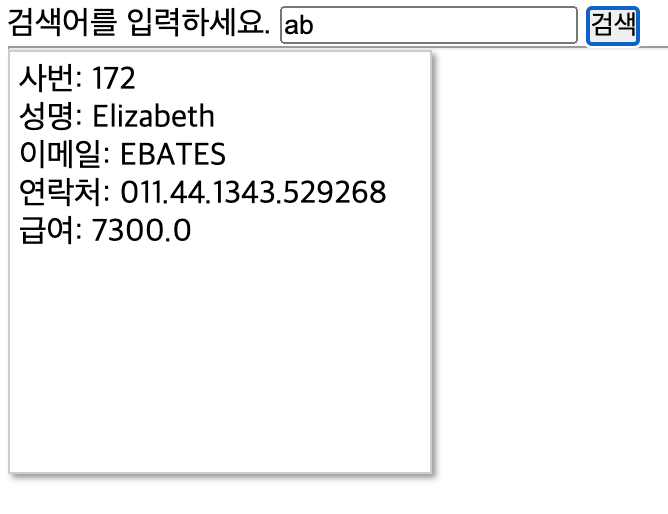

# Ajax(Asynchronous JavaScript and XML)

- 비동기 방식으로 서버와 통신하며, 브라우저의 새로고침 없이 특정 영역의 내용을 동적으로 변경할 수 있다.
- 별도의 외부 플러그인이나 라이브러리, API들이 필요없다.
- 브라우저 내부에 있는 자바스크립트만으로 처리 가능하다.
- 프로그램 방식을 Web 방식에서 App 방식으로 처리할 수 있다.

# 1. 예시 - Ajax 사용하지 않은 예
```jsp
<h3>간단 테스트</h3>
	<%
	String temp = request.getParameter("number");
	String message = ""; // 결과 메시지 
	int number = 0;
	if (temp != null && !temp.equals("")) {
		number = Integer.parseInt(temp);
		if (number % 2 == 0) {
			message = number + "는 짝수입니다.";
		} else {
			message = number + "는 홀수입니다.";		
            }
		}
	%>
	<form name="form" method="POST">
	    <label>정수를 입력하세요</label> 
	    <input type="text" size="6" name="number" />
	    <input type="submit" value="Check" />
	    </form>
	<div id="result">
		<%=message %>
	</div>
```
Check버튼 누르면 `페이지가 새로고침되며` 결과가 출력된다.

# 2. Ajax로 바꾸기
Ajax를 통해 전체 페이지가 새로고침되지 않게 하려면,
1) 서버에서 처리할 내용을 UI에서 분리
2) 처리된 내용을 화면에 출력하는 로직을 서버에 추가
3) UI단에서는 XMLHttpRequest 객체를 사용하여 서버의 처리 결과를 가져옴

# 3. Ajax 실습
```javascript
// Ajax를 통해 서버의 처리 결과를 result에 표시 
var form = document.form;
	
form.onsubmit = function() { // form 안에 submit 버튼이 클릭됐을 때
	var param = "?number=" + form.number.value;
		
	var request = new XMLHttpRequest();
	request.open("GET", "./ajax/OddEvenCheck.jsp" + param); //GET 타입으로 OddEvenCheck.jsp 파일에 요청 정보를 생성

	request.onreadystatechange = function() {
		if (request.status == 200 && request.readyState == 4) {
			// request.status == 200: 정상 요청됨 
			// request.readyStatus == 4: 정상 응답 
			var r = document.getElementById("result");
			r.innerHTML = request.responseText; // 응답 결과를 r에 집어넣음 
		}
			
	}
	
	request.send(); // 요청 정보를 서버에 전송 
	
	return false; // submit 고유의 기능을 취소 
}
```
jQuery로 써보자.
```javascript
var form = document.form;
	
form.onsubmit = function() { // form 안에 submit 버튼이 클릭됐을 때
	var param = "?number=" + form.number.value;
		
	var request = new XMLHttpRequest();
	request.open("GET", "./ajax/OddEvenCheck.jsp" + param); //GET 타입으로 OddEvenCheck.jsp파일에 요청 정보를 생성

	request.onreadystatechange = function() {
		if (request.status == 200 && request.readyState == 4) {
        $("#result").html(request.responseText);
        } // jQuery
    }
    request.send();

    return false;
}
```

# 4. 응용 - Ajax+JDBC
hr.employees 테이블을 JDBC로 연결하여 사원 정보를 검색하는 프로그램을 짜 보자
## 4.1. Application.java
JDBC
```java
package shop.jamielee;

import java.sql.Connection;
import java.sql.DriverManager;

public class Application {
	Connection conn;

	public Application() {
		
		try {
			Class.forName("oracle.jdbc.driver.OracleDriver");

			conn = DriverManager.getConnection(
					"jdbc:oracle:thin:@localhost:1521:XE", 
					"system", "oracle"
					);

		} catch (Exception e) {
			e.printStackTrace();
		}
		
	}
	
	public Connection getConn() {
		return conn;
	}
}


```
## 4.2. EmpVo.java
VO(Value Object)
- Read Only 속성. 한 건의 데이터를 저장한다.
```java
package shop.jamielee;
// Value Object: Read Only 속성
// 1건의 자료를 저장 
public class EmpVo {
	private int employee_id;
	private String first_name;
	private String email;
	private String phone_number;
	private double salary;
	
	public int getEmployee_id() {
		return employee_id;
	}
	public void setEmployee_id(int employee_id) {
		this.employee_id = employee_id;
	}
	public String getFirst_name() {
		return first_name;
	}
	public void setFirst_name(String first_name) {
		this.first_name = first_name;
	}
	public String getEmail() {
		return email;
	}
	public void setEmail(String email) {
		this.email = email;
	}
	public String getPhone_number() {
		return phone_number;
	}
	public void setPhone_number(String phone_number) {
		this.phone_number = phone_number;
	}
	public double getSalary() {
		return salary;
	}
	public void setSalary(double salary) {
		this.salary = salary;
	}	
}
```
다른 프로젝트 진행 시 꼭 `camelCase`로 작성하기. DB 기준으로 한다고 스네이크 표기법으로 해버림..
## 4.3. EmpDao.java
DAO(Data Access Object)
- 데이터에 접근하는 것을 목적으로 하는 객체.
```java
package shop.jamielee;

import java.sql.Connection;
import java.sql.PreparedStatement;
import java.sql.ResultSet;
import java.sql.SQLException;
import java.util.ArrayList;
import java.util.List;

// Data Access Object: 데이터에 접근하는 것을 목적으로 하는 객체 

public class EmpDao {
	public Connection conn;
	public PreparedStatement pstmt;
	public ResultSet rs;
	
	public EmpDao() {
		conn = new Application().getConn();
		
	}
	
	@SuppressWarnings("finally")
	public List<EmpVo> search(String findString) {
		List<EmpVo> list = new ArrayList<EmpVo>();
		
		try {
			String sql = "SELECT * FROM hr.employees where first_name like ? or email like ? or phone_number like ?";
			pstmt = conn.prepareStatement(sql);
			pstmt.setString(1, "%" + findString + "%");
			pstmt.setString(2, "%" + findString + "%");
			pstmt.setString(3, "%" + findString + "%");
			
			rs = pstmt.executeQuery();
			
			while(rs.next()) {
				EmpVo empvo = new EmpVo();
				empvo.setEmployee_id(rs.getInt("employee_id"));
				empvo.setFirst_name(rs.getString("first_name"));
				empvo.setEmail(rs.getString("email"));
				empvo.setPhone_number(rs.getString("phone_number"));
				empvo.setSalary(rs.getDouble("salary"));
				
				list.add(empvo);
			}
		} catch (Exception e) {
			e.printStackTrace();
		} finally {
			try {
				conn.close();
			} catch(SQLException e){
				e.printStackTrace();
			}
			return list;
		}
		
	}
}

```
## 4.4. EmpSearch.jsp
사용자의 요청 정보를 DAO에 전달한 후 그 결과를 다시 사용자에게 반환한다.
```jsp
<%@page import="shop.jamielee.EmpDao"%>
<%@page import="shop.jamielee.EmpVo"%>
<%@page import="java.util.List"%>
<%@ page language="java" contentType="text/html; charset=UTF-8"
	pageEncoding="UTF-8"%>
<%
// 사용자의 요청 정보를 DAO에 전달한 후 그 결과를 다시 사용자에게 반환 

	// request: 사용자의 요청 정보가 들어 있는 객체 
	String findString = request.getParameter("findString"); 

	EmpDao empDao = new EmpDao();
	List<EmpVo> list = empDao.search(findString);
	StringBuilder sb = new StringBuilder();
	
	String fmt = "<div class='emp'>"
				+ "<div>사번: %d</div>"
				+ "<div>성명: %s</div>"
				+ "<div>이메일: %s</div>"
				+ "<div>연락처: %s</div>"
				+ "<div>급여: %10.1f</div>"
				+ "</div>";
				
	for(EmpVo ev : list) {
		String str = String.format(fmt,
				ev.getEmployee_id(),
				ev.getFirst_name(),
				ev.getEmail(), 
				ev.getPhone_number(),
				ev.getSalary());
		
		sb.append(str); // 선택된 요소(sb)의 마지막에 새로운 요소나 컨텐츠 추가 
	}
	
	out.print(sb.toString());
%>
```

## 4.5. EmpSearchForm.jsp
UI
```jsp
<%@ page language="java" contentType="text/html; charset=UTF-8"
    pageEncoding="UTF-8"%>
<!DOCTYPE html>
<html>
<head>
<meta charset="UTF-8">
<title>emp_search_form</title>
<script src="https://code.jquery.com/jquery-3.5.1.js" integrity="sha256-QWo7LDvxbWT2tbbQ97B53yJnYU3WhH/C8ycbRAkjPDc=" crossorigin="anonymous"></script>
<style>
#items > div {
	display: inline-block;
	width: 200px;
	height: 200px;
	border: 1px solid #ccc;
	padding: 5px;
	box-shadow: 2px 2px 3px #999;
}
</style>
</head>
<body>
<div id="emp_search_form">
	<form name="form" method="POST" id="form">
		<label>검색어를 입력하세요.</label>
		<input type="text" name="findString"/>
		<input type="button" value="검색" id="btnFind"/>
	</form>
	<hr/>
	<div id="items"></div>
</div>
<script>
$("#btnFind").on("click", function(){
	let param = $("#form").serialize(); // 직렬화
	let request = new XMLHttpRequest();
	request.open("GET", "./ajax/EmpSearch.jsp?" + param); // GET 타입으로 EmpSearch.jsp 파일에 요청 정보를 생성 
	request.onreadystatechange = function() {
		if(request.status==200 && request.readyState == 4) {
			$("#items").html(request.responseText);
		}
	}
	
	request.send();
	
})
</script>
</body>
</html>
```
## 4.6. 결과 화면
