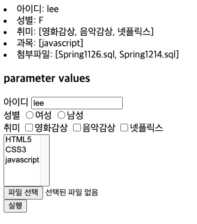
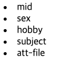
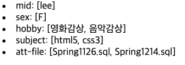
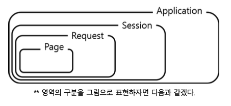
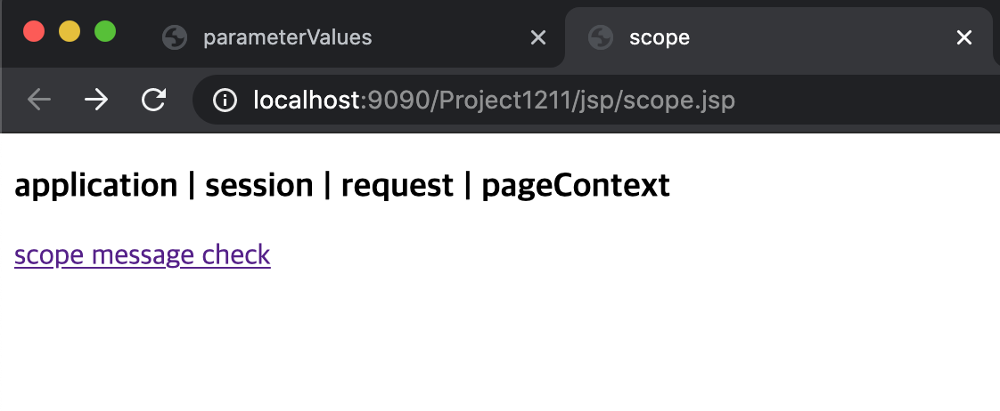
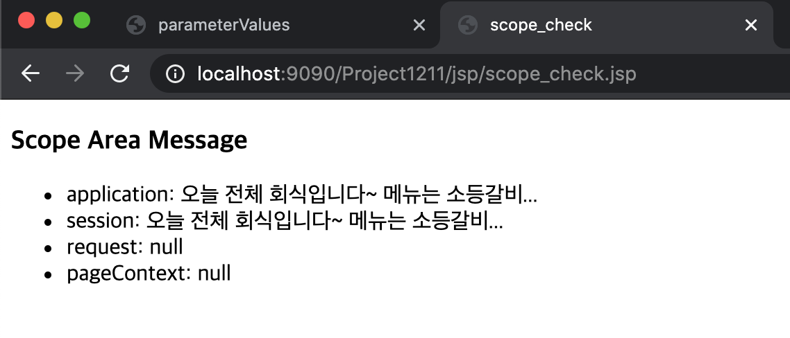
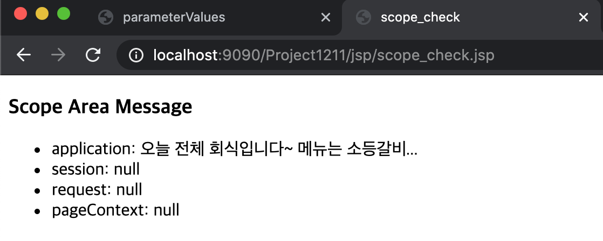
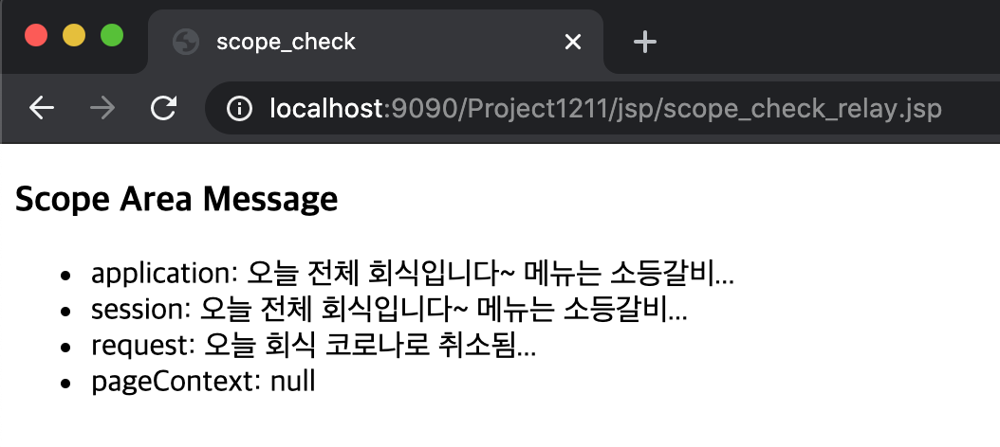

# 1. request(요청 정보) 세부 사용법
## 1.1. request.getParameter()
항목이 1개
- ex) text, radio button, number, date, color, datetime...
## 1.2. request.getParameterValues()
항목이 2개 이상
- ex) checkbox, select

실습
```jsp
<%@page import="java.util.Arrays"%>
<%@ page language="java" contentType="text/html; charset=UTF-8"
	pageEncoding="UTF-8"%>
<!DOCTYPE html>
<html>
<head>
<meta charset="UTF-8">
<title>parameterValues</title>
</head>
<body>
	<%
	request.setCharacterEncoding("UTF-8");
	response.setContentType("text/html; charset=UTF-8");

	
	if(request.getMethod().equals("POST")) {
		String mid = request.getParameter("mid"); //name으로 가져옴 
		String sex = request.getParameter("sex");
		
		// 체크된 값이 여러 개일 때는 반환 값이 배열 
		String[] hobby = request.getParameterValues("hobby");
		String[] subject = request.getParameterValues("subject");
		String[] attFile = request.getParameterValues("att-file");
		
		out.println("<li>아이디: " + mid + "</li>");
		out.println("<li>성별: " + sex + "</li>");
		out.println("<li>취미: " + Arrays.toString(hobby) + "</li>");
		out.println("<li>과목: " + Arrays.toString(subject) + "</li>");
		out.println("<li>첨부파일: " + Arrays.toString(attFile) + "</li>");
	}
	
	%>
	<div id="parameter">
	<h3>parameter values</h3>
	<form name="form_param" method="POST">
		<label for="mid">아이디</label>
		<input type="text" id="mid" name="mid" value="lee"/>
		<br/>
		<label>성별</label>
		<label><input type="radio" name="sex" value="F"/>여성</label>
		<label><input type="radio" name="sex" value="F"/>남성</label>
		<br/>
		<label>취미</label>
		<label><input type="checkbox" value="영화감상" name="hobby"/>영화감상</label>
		<label><input type="checkbox" value="음악감상" name="hobby"/>음악감상</label>
		<label><input type="checkbox" value="음악감상" name="hobby"/>넷플릭스</label>
		<br/>
		<select name="subject" size="5" multiple>
			<option value="html5">HTML5</option>
			<option value="css3">CSS3</option>
			<option value="javascript">javascript</option>
		
		</select>
		<br/>
		<input type="file" name="att-file" multiple/>
		<br/>
		<input type="submit" value="실행"/>
	</form>
	
	</div>
</body>
</html>
```
실행 결과<br/>


## 1.3. request.getParameterNames()
모든 파라미터의 이름을 구한다.
```java
Enumeration<String> enumeration = request.getParameterNames();
		
		while(enumeration.hasMoreElements()) {
			String name = enumeration.nextElement();
            out.print("<li>" + name);
		}
```
실행 결과<br/>

## 1.4. request.getParameterMap()
전송한 파라미터를 맵 형식으로 구한다.
```java
Map<String, String[]> map = request.getParameterMap();
		Set<String> keySet = map.keySet();
		Iterator<String> iterator = keySet.iterator();
		
		while(iterator.hasNext()) {
			String key = iterator.next();
			String[] values = map.get(key);
			
			out.print("<li>" + key + ": " + Arrays.toString(values));
			out.print("<br/>");
		}
```
실행 결과<br/>


# 2. 자료구조 틈새 정리
## 2.1. List<T>
1. 순서 있음
2. 중복 가능
- 배열 구조와 가장 유사함
- 대표적인 구조: ArrayList, Vector

## 2.2. Set<T>
1. 순서 없음 -> Iterator로 값 꺼냄
2. 중복 불가능
- 대표적인 구조: HashSet

## 2.3. Map<K, V>
1. 순서 없음
2. Key: 중복 불가능
3. Value: 중복 가능
- 대표적인 구조: HashMap
# 3. 로직 분리
parameterValues_form.jsp
```jsp
// div 태그 아래쪽에 script 추가
<script>
	$("#form_param").on("submit", function() {
		var param = $("#form_param").serialize();
		$("#result").load("parameterValues_control.jsp", param);
		return false; //submit 기능 중지 
	})
	
</script>
```
parameterValues_control.jsp
```jsp
<%@page import="java.util.Iterator"%>
<%@page import="java.util.Set"%>
<%@page import="java.util.Map"%>
<%@page import="java.util.Enumeration"%>
<%@page import="java.util.Arrays"%>
<%@ page language="java" contentType="text/html; charset=UTF-8"
    pageEncoding="UTF-8"%>
<!DOCTYPE html>
<html>
<head>
<meta charset="UTF-8">
<title>Insert title here</title>
</head>
<body>
	<%
	request.setCharacterEncoding("UTF-8");
	response.setContentType("text/html; charset=UTF-8");

	
	if(request.getMethod().equals("GET")) {
		String mid = request.getParameter("mid"); //name으로 가져옴 
		String sex = request.getParameter("sex");
		
		// 체크된 값이 여러 개일 때는 반환 값이 배열 
		String[] hobby = request.getParameterValues("hobby");
		String[] subject = request.getParameterValues("subject");
		String[] attFile = request.getParameterValues("att-file");
		
		out.println("<li>아이디: " + mid + "</li>");
		out.println("<li>성별: " + sex + "</li>");
		out.println("<li>취미: " + Arrays.toString(hobby) + "</li>");
		out.println("<li>과목: " + Arrays.toString(subject) + "</li>");
		out.println("<li>첨부파일: " + Arrays.toString(attFile) + "</li>");
		out.print("<hr>");
	}
	
		Enumeration<String> enumeration = request.getParameterNames();
		
		while(enumeration.hasMoreElements()) {
			String name = enumeration.nextElement();
			out.print("<li>" + name);
		}
		out.print("<br/>");
		out.print("<hr>");
		
		Map<String, String[]> map = request.getParameterMap();
		Set<String> keySet = map.keySet();
		Iterator<String> iterator = keySet.iterator();
		
		while(iterator.hasNext()) {
			String key = iterator.next();
			String[] values = map.get(key);
			
			out.print("<li>" + key + ": " + Arrays.toString(values));
			
		}
		out.print("<hr>");
	
	%>
</body>
</html>
```
# 4. File 업로드/다운로드에 관하여
File을 넘기려면 form 태그 안에 `enctype= "multipart/form_data"`를 집어넣어 줘야 함
```html
<form name="사용자정의" method="POST" enctype="multipart/form-data">
    <input type="file" name="사용자정의">
</form>
```
- jsp에서 사용하려면 cos.jar / File_upload.jar 라이브러리 필요

# 5. 내장 객체의 영역(scope)
객체의 유효범위(유효기간)을 뜻함. 해당 객체가 얼마나 유지되는지 지정해주는 것

## 5.1. application
하나의 웹 애플리케이션과 관련된 영역. 잘 안 씀
## 5.2. session
하나의 브라우저와 관련된 영역
## 5.3. request
하나의 요청을 처리할 때 사용하는 영역
## 5.4. page
하나의 jsp 페이지를 처리할 때 사용되는 영역. 잘 안 씀
## 5.5. 테스트
1. scope.jsp
```jsp
<%@ page language="java" contentType="text/html; charset=UTF-8"
    pageEncoding="UTF-8"%>
<!DOCTYPE html>
<html>
<head>
<meta charset="UTF-8">
<title>scope</title>
</head>
<body>
<div id="scope">
	<h3>application | session | request | pageContext</h3>
	<%
		String message = "오늘 전체 회식입니다~ 메뉴는 소등갈비...";
		application.setAttribute("message", message); // 잘 안 씀
		session.setAttribute("message", message); // 로그인/로그아웃 - 개인별로 만들어짐, 페이지가 바뀌더라도 사라지지 않음 
		request.setAttribute("message", message); // <form>
		pageContext.setAttribute("message", message); // 잘 안 씀
		
		//session 영역의 유지시간 설정(5초)
		session.setMaxInactiveInterval(5);
	
	%>
	
	<a href="scope_relay.jsp">scope message check</a>
</div>
</body>
</html>
```
실행 결과

2. scope_check.jsp
```jsp
<%@ page language="java" contentType="text/html; charset=UTF-8"
    pageEncoding="UTF-8"%>
<!DOCTYPE html>
<html>
<head>
<meta charset="UTF-8">
<title>scope_check</title>
</head>
<body>
<div id="scope-check">
	<h3>Scope Area Message</h3>
	<ul>
		<li>application: <%=application.getAttribute("message") %></li><!-- 세미콜론 검지 -->
		<li>session: <%= session.getAttribute("message") %></li>
		<li>request: <%=request.getAttribute("message") %></li>
		<li>pageContext: <%=pageContext.getAttribute("message") %></li>
	</ul>
	
</div>
</body>
</html>
```
실행 결과

5초 뒤에 새로고침하면

3. scope_check_relay.jsp
- submit 체크를 위한 jsp(화면 전환)
```jsp
<%@ page language="java" contentType="text/html; charset=UTF-8"
    pageEncoding="UTF-8"%>
<!DOCTYPE html>
<html>
<head>
<meta charset="UTF-8">
<title>scope_check_relay</title>
</head>
<body>
<%
	request.setAttribute("message", "오늘 회식 코로나로 취소됨...");
	RequestDispatcher dispatcher = request.getRequestDispatcher("scope_check.jsp");
	dispatcher.forward(request, response);
%>
</body>
</html>
```
scope.jsp 파일에서 제출 버튼을 누르면
