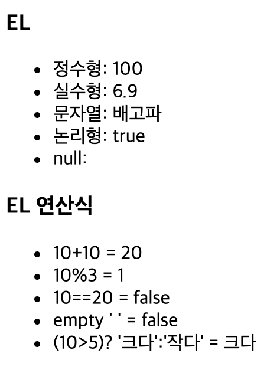
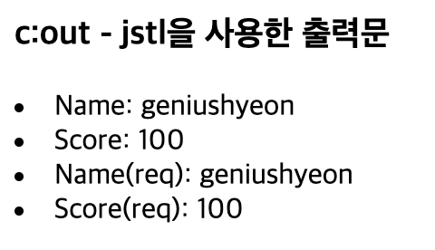
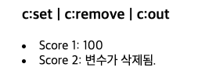
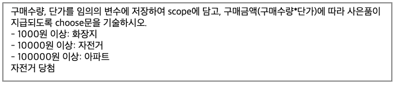
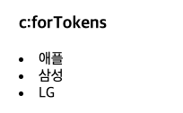
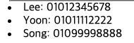

# 1. JSP 액션 태그
## 1.1. <jsp: useBean>
`Bean`을 생성하고 사용하기 위한 환경을 정의
- Bean: 프로그램에서 사용될 여러 개의 정보를 모아 놓는 데이터 저장소 역할을 하는 클래스
## 1.2. <jsp: setProperty>
`Bean`에서 속성 값을 할당
- 실습
```jsp
<%@page import="shop.jamielee.MemberDao"%>
<%@ page language="java" contentType="text/html; charset=UTF-8"
    pageEncoding="UTF-8"%>
<jsp:useBean id = "memberDao" class=shop.jamielee.MemberDao/>
<jsp:useBean id = "memberVo" class=shop.jamielee.MemberVo/>
<!-- memberVo 객체가 가지고 있는 모든 setter를 사용하여 값을 대입 -->
<jsp:setProperty property="*" name="memberVo"/>
<%
	// database에 존재 유무
	
	boolean b = memberDao.signin(memberVo.getId(), memberVo.getPassword());
	
	if(b) {
	session.setAttribute("id", memberVo.getId());
	response.sendRedirect("../index.jsp");
	
	} else {
		// 로그인 실패 
		out.println("<script>alert('failed')");
		out.println("location.href='../index.jsp'</script>");
		// print로 쓰면 안됨(println으로 쓸것)
		
	}

%>
```
코드가 훨씬 간단해진다.

# 2. MVC Model 2 방식
- MVC는 `Model`, `View`, `Controller`로 각각의 역할을 나누어 작업하고자 하는 일을 분담시키는 것을 말한다.
## 2.1. Model
애플리케이션 로직을 담당하는 부분으로 데이터베이스와의 로직을 담당하는 부분
- Java Bean/서비스 클래스를 이용하여 담당하게 함
- 비즈니스 로직이 구현되어 있음
- `CRUD` 수행
## 2.2. View
Client에게 보여지는 부분
- Model에서 생성된 데이터를 Client에게 제공하는 역할
- JSP와 JSTL을 이용하여 구현
## 2.3. Controller
사용자의 요청을 받아서 요청에 해당하는 비즈니스 로직을 수행하도록 하고, 작업 결과에 따라 응답을 결정하는 역할을 함
- Model과 View 사이의 데이터 전달 역할
- Servlet
- 사용자 요청 받음 -> 분석 -> 자바 빈 생성 및 비즈니스 로직이 구현된 메소드 실행 -> 사용자의 요청을 jsp 페이지 혹은 특정 url로 이동시킴

## 2.4. 필요 요소
- View(JSP): 사용자가 요청하거나 요청한 정보를 응답받아 볼 수 있는 페이지
- Controller(Servlet): 사용자의 요청을 전달받아 응답처리를 위한 Service를 호출하고 결과를 View에 전송하는 클래스
- Service(Model): 여러 DAO를 호출하여 데이터 접근/갱신을 하고, 그렇게 읽은 데이터에 대한 비즈니스 로직을 수행하여 Controller에 그 결과를 전송하는 클래스
- DAO(Model): Data Access Object
  - 데이터베이스에 직접 접근하여 요청받은 결과를 반환하는 클래스
- DTO/VO(Model): Data Transfer Object/Value Object
  - 계층 간 데이터 교환을 위한 객체 클래스

# 3. EL(Expression Language)
<%= %>, out.println()과 같은 자바 코드를 사용하지 않고 좀 더 간편하게 출력을 지원하기 위한 도구. 배열이나 컬렉션에서도 사용되고, JavaBean의 프로퍼티에서도 사용된다.
```jsp
<%@ page language="java" contentType="text/html; charset=UTF-8"
	pageEncoding="UTF-8"%>
<!DOCTYPE html>
<html>
<head>
<meta charset="UTF-8">
<title>el_test</title>
</head>
<body>
	<h3>EL</h3>
	<ul>
		<li>정수형: ${100 }</li>
		<li>실수형: ${6.9 }</li>
		<li>문자열: ${"배고파" }</li>
		<li>논리형: ${true }</li>
		<li>null: ${null }</li>
	</ul>
	<h3>EL 연산식</h3>
	<ul>
		<li>10+10 = ${10+10}</li>
		<li>10%3 = ${10%3 }</li>
		<li>10==20 = ${10==20 }</li>
		<li>empty ' ' = ${empty ' ' }</li>
		<li>(10>5)? '크다':'작다' = ${(10>5)? '크다':'작다' }</li>
	</ul>
</body>
</html>
```
실행 결과

# 4. JSTL(Jsp Standard Tag Library)
- [톰캣홈페이지 T](https://tomcat.apache.org/taglibs.html) -> Download
다운로드
`compat`,`impl`,`jstel`,`spec`

- jsp 맨 상단에 tag library를 삽입해준다.
```jsp
<%@taglib prefix="c" uri="http://java.sun.com/jstl/core_rt"%>

// prefix=접두사 / uri=경로
```
## 4.1. c:out
JSTL을 사용한 출력문
1. 전제 조건 설정
- `setAttribute()`로 값 저장
```jsp
	<%
		String name = "geniushyeon";
		int score = 100;
		
		//전제 조건: setAttribute로 값 저장
		pageContext.setAttribute("pageName", name);
		pageContext.setAttribute("pageScore", score);
		
		request.setAttribute("reqName", name);
		request.setAttribute("reqScore", score);
		
	%>
```
2. `c:out`으로 출력해보기
```jsp
<h3>c:out - jstl을 사용한 출력문</h3>
	<li>Name: <c:out value="${pageScope.pageName }" default="이름을 입력하세요"/></li>
	<li>Score: <c:out value="${pageScope.pageScore }" default="0점"/></li>
	<li>Name(req): <c:out value="${requestScope.reqName }" default="이름을 입력하세요"/></li>
	<li>Score(req): <c:out value="${requestScope.reqScore }" default="0점"/></li>
```
실행 결과


## 4.2. c:set / c:remove
```jsp
<h3>c:set | c:remove | c:out</h3>
	<c:set var="score" value="100"/>
	<li>Score 1: <c:out value="${score }"/></li>
	<c:remove var="score"/>
	<li>Score 2: <c:out value="${score }" default="변수가 삭제됨."/></li>
```
실행 결과<br/>
<br/>
`c:set`으로 변수를 초기화했을 때는 정상적으로 출력되고, `c:remove`로 변수를 삭제한 후에는 `default`에 저장된 값이 출력된다.

## 4.3. c:if
```jsp
<h3>c:if</h3>
	<li>
		<c:if test="${reqScore>90 }">
			<font color="red">장학생</font>
		</c:if>
	</li>
```
실행 결과<br/>
<br/>
위 코드를 Java로 쓰면
```java
public static void main(String[] args) {
	public int reqScore = 100;
	if (reqScore > 90) {
		System.out.println("장학생");
	}
}
```

## 4.4. c:if 예제 하나 더
변수 kor, eng에 임의의 값을 대입하여 request 영역에 저장한 후, 두 변수의 합이 180 이상이면 '우등생' 출력.
```jsp
<%
	int kor = 95;
	int eng = 90;
			
	request.setAttribute("korScore", kor);
	request.setAttribute("engScore", eng);
		
%>
		
<li>
	<c:if test="${korScore + engScore >= 180 }">
		<font color="red">우등생</font>
	</c:if>
</li>
```

## 4.5. c:choose / c:when / c:otherwise
if ~ else if ~ else 와 비슷함
```jsp
<fieldset>
		<div>
			구매수량, 단가를 임의의 변수에 저장하여 scope에 담고, 구매금액(구매수량*단가)에 따라 사은품이 지급되도록 choose문을 기술하시오.<br/>
			- 1000원 이상: 화장지<br/>
			- 10000원 이상: 자전거<br/>
			- 100000원 이상: 아파트<br/>
		</div>
		<%
         int ea = 100; //구매수량
         int price = 500; //단가
         int amount = ea*price;
         
         request.setAttribute("amount", amount);
      %>
      <c:choose>
         <c:when test="${amount>=100000 }">아파트 당첨</c:when>
         <c:when test="${amount>=10000 }">자전거 당첨</c:when>
         <c:when test="${amount>=1000 }">화장지 </c:when>
         <c:otherwise>다음기회에</c:otherwise>
      </c:choose>
	</fieldset>
```
실행 결과<br/>


## 4.6. c:forTokens
문자열을 분리자를 사용하여 분리한 후 출력한다.
```jsp
<h3>c:forTokens</h3>
	<c:forTokens var="item" items="애플, 삼성, LG" delims=", ">
		<li><c:out value="${item }"/></li>
	</c:forTokens>
```
실행 결과<br/>


## 4.7. c:forEach
```jsp
<%
		List<MemberVo> list = new ArrayList<>();
		MemberVo memberVo = new MemberVo();
		memberVo.setId("Lee");
		memberVo.setPhonenumber("01012345678");
		list.add(memberVo);
		
		memberVo = new MemberVo();
		memberVo.setId("Yoon");
		memberVo.setPhonenumber("01011112222");
		list.add(memberVo);
		
		memberVo = new MemberVo();
		memberVo.setId("Song");
		memberVo.setPhonenumber("01099998888");
		list.add(memberVo);
		
		request.setAttribute("list", list);
	
	%>
	
	<c:forEach var="vo" items="${list }">
		<li><c:out value="${vo.id }: ${vo.phonenumber }"/></li>	
	
	</c:forEach>
```
실행 결과<br/>
