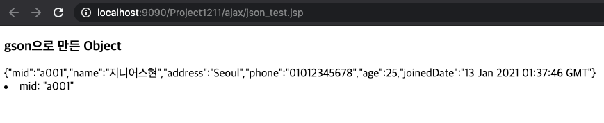
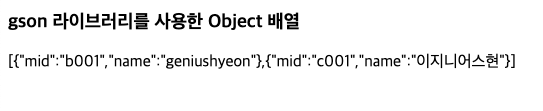

# JSON
# 1.1. 데이터 형식
- 기본: 문자열 패턴
- 1) map 구조 : ```{"key" : "value"}```
- 2) 배열 구조 : ```["value", "value", ...]```
- 3) 혼합 구조 : ```{[]}``` or ```[{}]``` or ```{{}}``` or ```[[]]```

# 1.2. gson library
## 1.2.1. gson library 설치
- https://mvnrepository.com/artifact/com.google.code.gson/gson/2.8.6

## 1.2.2. jsp 최상단에 import
```jsp
<%@ page import="com.google.gson.JsonObject" %>
```

## 1.2.3. 테스트
```jsp
<%@page import="java.util.Date"%>
<%@ page import="com.google.gson.JsonObject" %>
<%@ page language="java" contentType="text/html; charset=UTF-8"
    pageEncoding="UTF-8"%>

<!DOCTYPE html>
<html>
<head>
<meta charset="UTF-8">
<title>JSON test</title>
</head>
<body>
<%
	// gson을 사용하여 json의 object 생성 
	JsonObject obj1 = new JsonObject();
	obj1.addProperty("mid", "a001");
	obj1.addProperty("name", "지니어스현");
	obj1.addProperty("address", "Seoul");
	obj1.addProperty("phone", "01012345678");
	obj1.addProperty("age", 25);
	obj1.addProperty("joinedDate", new Date().toGMTString());
	
	out.print("<h3>gson으로 만든 Object</h3>");
	out.print(obj1);
	out.print("<li>mid: " + obj1.get("mid") + "</li>");
	
%>
</body>
</html>
```
- 결과

### 1.2.3.1. gson 라이브러리의 json 배열 구조
```jsp
<%
	// gson 라이브러리의 json 배열 구조
	JsonArray array = new JsonArray();
	JsonObject obj2 = new JsonObject();
	obj2.addProperty("mid", "b001");
	obj2.addProperty("name", "geniushyeon");
	
	array.add(obj2);

    JsonObject obj3 = new JsonObject();
	obj3.addProperty("mid", "c001");
	obj3.addProperty("name", "이지니어스현");
	
	array.add(obj3);
	
	out.print("<h3>gson 라이브러리를 사용한 Object 배열</h3>");
	out.print(array);
%>
```
- 결과
